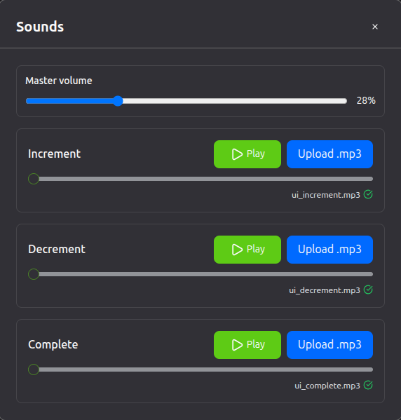

# Progress Tracker (Electron + React + Tailwind)

A simple desktop app for customisable progress bars with notes, themes, sounds, and encrypted Dropbox (manual) backup. Only tested on Ubuntu.

## Features

- Multiple progress bars:
  - Can add notes;
  - Animations and sounds on increment, decrement, task completion;
  - Customisable: title, values, units, increment steps, colours, bar patterns;
- Auto‑saving app data in local storage;
- App colours are fully customisable (although the grouping might be a bit lacking);
- User must upload their own sounds + can set the master volume;
- Manual Dropbox sync/restore:
  - Progress bar data is encrypted before upload and stored encrypted on Dropbox.
  - Settings (theme + sound preferences) and `.mp3` files are uploaded as plaintext.
  - Encryption password and refresh tokens are stored securely using Electron's `safeStorage`;
- Custom window controls;

## Screenshots

- Main

  

- Settings drawer

  

- Cloud sync modal

  

- Sounds modal

  

- Theme modal

  

- Completed progress bar

  

## What I learned / used

- Gitmoji for all commits:
  - Was a bit tedious at the beginning, but I ended up liking it. Good for understanding what type of changes a commit contains + forces you to make more focused commits;
  - Had to take care to add one on merges (and use `git-filter-repo` when I forgot to);

- Working with Electron:
  - IPC stuff was pretty interesting;
  - Making backend errors cross the IPC boundary into the frontend (for user feedback) was a bit more painful than it should have been. Settled for a `handleInvoke()` wrapper which returns `{ok, data | error}`;
  - Typed error taxonomy over IPC: `Canceled`, `Network`, `DropboxApi`, `TokenRefreshFailed`, `OAuthConfig`, `Crypto`, `SafeStorage`, `Filesystem`, `NotFound`, `Unknown`. UI maps these 1:1 to dialogs/states (`ipc/ipc-helpers.ts`, `utils/main-process-errors.ts`).

- OAuth:
  - Learned the different flavours and flows for OAuth when trying to cheat Google Drive's broken OAuth (my app was registered as an insecure TV application for a brief moment);
  - Settled for: Loopback redirect + `pkce-challenge` (verifier/challenge) → external browser → authorisation code → token exchange → refresh token encrypted with `safeStorage`;
  - First tried Google Drive, couldn't make the untrusted environment OAuth flow work there; worked like a charm on Dropbox.

- Sync/auth state machine (React, `frontend/src/sync/useSyncState.tsx`):
  - Auth was pretty difficult to get right. There are multiple things that can fail, each can fail for different reasons and may require different user actions and/or things to display. Began with a mess of `useState` calls, settled for a state‑machine‑like `useReducer`;
  - Example states: `SIGNED_OUT/IN`, `PASSWORD_SYNC/RESTORE`, `SYNCING`, `SUCCESS/ERROR`, `SAVE_PASSWORD`;
  - Minimum loader (700ms) to avoid flicker.

- Encryption:
  - Bars encrypted client‑side (AES‑GCM‑256, PBKDF2/SHA‑256 100k, 16‑byte salt, 12‑byte IV) into `{ salt, iv, encryptedData }` (base64 JSON);
  - Wrong password (renderer crypto) vs network/API (main) errors are surfaced differently by our auth state machine;

- Cloud sync (`ipc/dropbox.ts`, `frontend/src/sync/useDropboxSync.ts`):
  - Per‑operation `AbortController` (user can cancel sync operations, at least in theory `;)`) - found out about it recently and really wanted to use it somewhere;
  - Token cache with 5‑min buffer and 1‑hour cap;
  - Existence check + user overwrite warning before restore;
  - Encrypted bars → `goal-tracker.appdata.enc`;
  - Settings JSON and `.mp3` files remain plaintext;
  - Auto‑sync on close;
  - Definitely the part that took the longest; plenty of logic errors initially.

- Local persistence (`ipc/data.ts`, `frontend/src/storage/useDataPersistence.ts`):
  - "Atomic" saves (saving to a temp file then renaming it to the target file name);
  - Auto‑save on any data change and on app close;
  - Theme, sounds, data applied on application start;
  - Preserve unspecified fields (`lastSynced`, `sounds`, `theme`).

- Sounds pipeline:
  - Learned that associating sounds with actions is pretty easy;
  - Doing syncing right is hard: wasted a lot of time on a bug in which the files restored from Dropbox were immediately overwritten by the local files.

- React practice:
  - Wrote a few more complex hooks: `useProgressBars`, `useDataPersistence`, `useDropboxSync`, `useSoundInitialization`, `useDragAndDrop`.
  - `@dnd-kit` reordering, controlled modals/forms, Tailwind v4 + CSS vars, frameless window controls in React.

- Platform:
  - Getting the icon to show in my dock took way too much time; should have read the docs instead of relying on an LLM;
  - Electron Builder worked seamlessly, until I added Jest and a few tests. Couldn't get the config right afterwards, so I just reverted that change;
  - A lot of config issues at the beginning;
  - CSP: `connect-src` limited to Dropbox.

- Tailwind:
  - I am starting to become a bit disillusioned with it; customising things is not as easy as I would have wanted;
  - Still good for fast prototyping + theming becomes a bit easier with DaisyUI, but I do need to look into alternatives for more complex use‑cases (+ React).

- ShadCN:
  - Not much to say about it, easy to use + install;
  - Used it for a slider;
  - Still prefer defining my own components / DaisyUI.

- Lucide:
  - Was really nice for painlessly integrating SVGs into my components (tried some SVG package I cannot remember before it and had to do some rather hacky things to get it working).

- LLMs:
  - I decided to heavily use LLMs for this project, out of sheer curiosity about the process. I'm not very impressed with the result. I prefer iterating through the code myself rather than through an LLM - it ends up being more time‑consuming + costing me money otherwise. I also ended up learning less than I would have implementing everything from scratch myself. Still, given that I actually use this app daily (i.e., the aim of the project was split between learning and getting something done fast), I am okay with the result.
  - It's also very odd how inconsistent they are. One day a model's fine, the next it's significantly dumbed‑down only to be all right again the day after.
  - Still, they were invaluable for:
    - making informed choices about how to implement certain features;
    - solving config errors (which I absolutely dislike dealing with in hobby projects);
    - coming up with theories about how a bug might have happened and how to fix it;
  - Some of them adamantly refuse to read the documentation, even after you point out that it changed since they were last trained; I found that pretty funny for some reason.

## Run (Ubuntu)

1. Install dependencies:
   - Root: `npm install`
   - Frontend: `cd frontend && npm install`
2. Create `.env` in project root:
   - `DROPBOX_APP_KEY=your_app_key`
3. Dev: `npm run dev` (Vite + Electron).

## Build (Debian package)

- `npm run pack` → `.deb` in `release/`.

## Platform

- Built and tested on Ubuntu (X11/Wayland). No plans for Windows or macOS.

# A small rant about Google Cloud

Google's OAuth implementation for this use‑case does not properly support PKCE. You're still required to store and use a client secret (which you simply cannot secure in an Electron desktop app). Google has patched the usual workarounds over time, but hasn't fixed the underlying auth flow. The "proper" route would then be to run a small backend service purely to hold a secret you shouldn't need in the first place, and wire your desktop app through it. That's just seems needlessly complex for a hobby desktop client.

Add to that a few other annoyances: I couldn't remove ancient, abandoned projects I don't own from Google Cloud (apparently a "feature"), and support was ... hit‑and‑miss, to put it politely.

Bottom line: GCP has been pretty disappointing. I've had a far better time with AWS, and for hobby projects I'll likely try smaller providers (Fly.io, Heroku, etc.).
